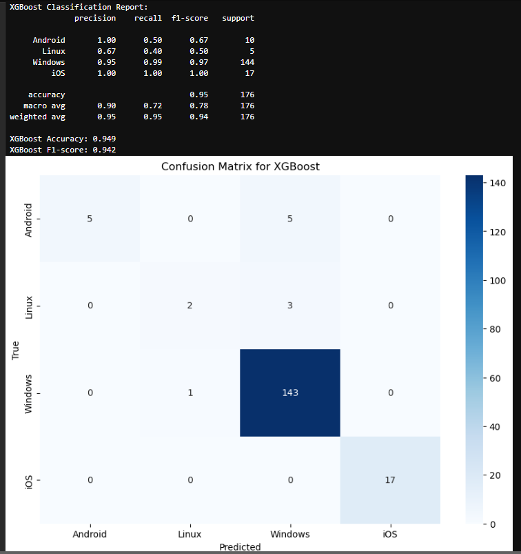

# Loading the file 1.json

- Transposing the matrix.
- Renaming the parameter 'ip' to 'ip_org' for easier merging with another dataframe

# Loading the file 2.json

- Copying into a new object to avoid altering the originally loaded data.

- Removing duplicates based on the 'ip' field.

- Merging the two dataframes using the 'ip' key to determine the organization name.

- The 'organization' field contains entries marked as 'n/a', so these are replaced with values from the 'isp' field.

- Extracting the OS name from the 'os_prediction' field and saving it in a new column 'os'.

- Doing the same with the 'user_agent' field and saving it in a new column 'u_a_os'.

- Keeping the parameters 'organization', 'ip', 'os', 'u_a_os', 'tls', 'tcpip', 'http2'.

- Removing duplicates based on the 'organization' field.

- Filtering the dataset to keep only rows where the predicted OS matches the user agent OS to increase prediction accuracy.

- Extracting presumably important information from the 'tls', 'tcpip', and 'http2' fields.

  From [tls] -> ciphers: [TLS_AES_128_GCM_SHA256, TLS_CHACHA20_POLY1305_SHA256, TLS_AES_256_GCM_SHA384, TLS_ECDHE_ECDSA_WITH_AES_128_GCM_SHA256, TLS_ECDHE_RSA_WITH_AES_128_GCM_SHA256, TLS_ECDHE_ECDSA_WITH_CHACHA20_POLY1305_SHA256, TLS_ECDHE_RSA_WITH_CHACHA20_POLY1305_SHA256, TLS_ECDHE_ECDSA_WITH_AES_256_GCM_SHA384, TLS_ECDHE_RSA_WITH_AES_256_GCM_SHA384, TLS_ECDHE_ECDSA_WITH_AES_256_CBC_SHA, TLS_ECDHE_ECDSA_WITH_AES_128_CBC_SHA, TLS_ECDHE_RSA_WITH_AES_128_CBC_SHA, TLS_ECDHE_RSA_WITH_AES_256_CBC_SHA, TLS_RSA_WITH_AES_128_GCM_SHA256, TLS_RSA_WITH_AES_256_GCM_SHA384, TLS_RSA_WITH_AES_128_CBC_SHA, TLS_RSA_WITH_AES_256_CBC_SHA]
  and separately - [ja3_hash]: 'c279b0189edb9269da7bc43dea5e0c36'.

  From [tcpip] -> 'cap_length, 74, dst_port, 443, src_port, 56278, ip, id, 54072, tos, 72, ttl, 45, ip_version, 4, dst_ip, 172.86.96.108, src_ip, 165.227.55.199, tcp, checksum, 57223, mss, 1460, options, MSS:1460,SACKPermitted:,Timestamps:767277104/0,NOP:,WindowScale:7, options_order, MSS,SACKPermitted,Timestamps,NOP, WindowScale, seq, 3349149692, window, 64240'.

  From [http2] -> 'settings': [HEADER_TABLE_SIZE = 65536, INITIAL_WINDOW_SIZE = 131072, MAX_FRAME_SIZE = 16384].
- Creating a new field 'text' where a concatenated string from all 4 parameters is placed.
- Removing extra spaces and commas in the string for further vectorization.

# Model Training

- For training the model, XGBClassifier was used, as it performed better in this scenario compared to LogisticRegression, SVM, and RandomForest.
- For encoding the string, TF-IDF was used, and for the target variable, LabelEncoder was applied.
- From the initial 7448 data points, the final dataset was formed with 879 observations. Of these, almost 81% belong to the Windows OS. Therefore, there is a high likelihood of bias in the evaluation due to the small sample size and uneven distribution.
Windows    81.68 %
iOS         9.55 %
Android     5.8 %
Linux       2.95 %

- Despite this, the model performs well with the Windows and iOS classes but struggles with Android and Linux.
  The low Recall for Android and Linux indicates that the model misses many examples of these classes (high level of False Negative).
       

